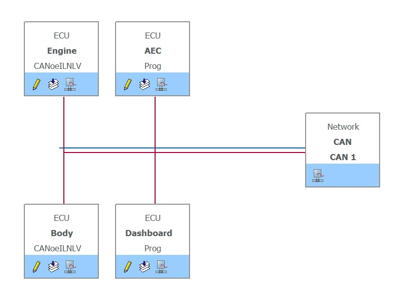
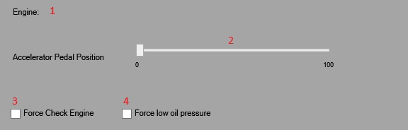
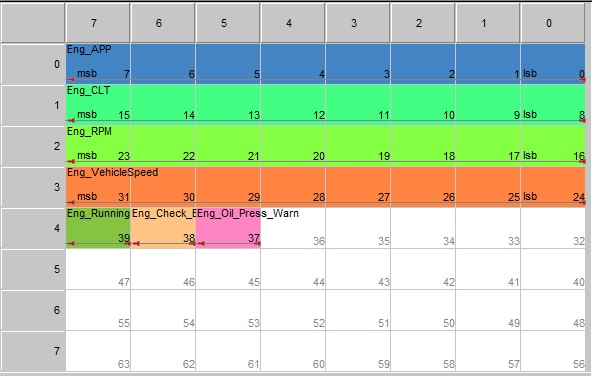
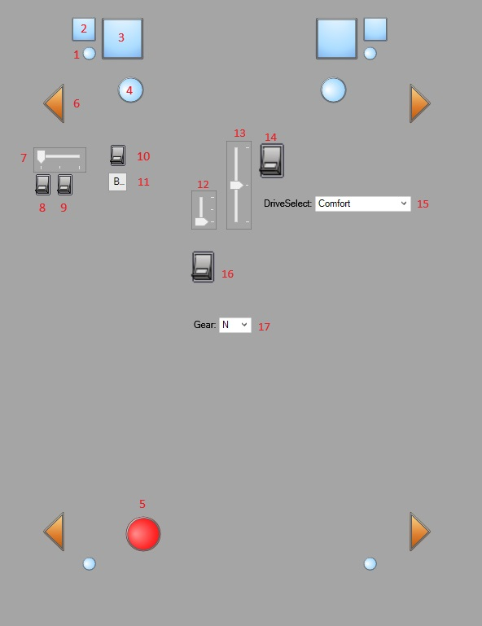
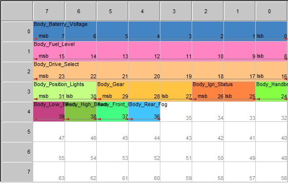
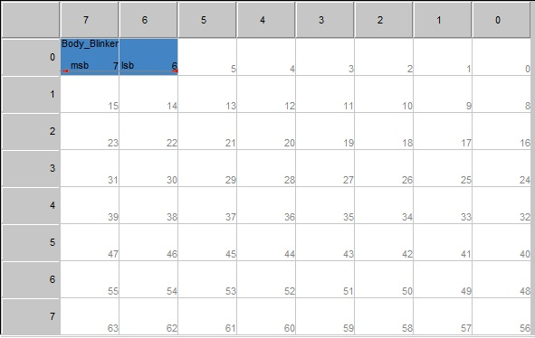
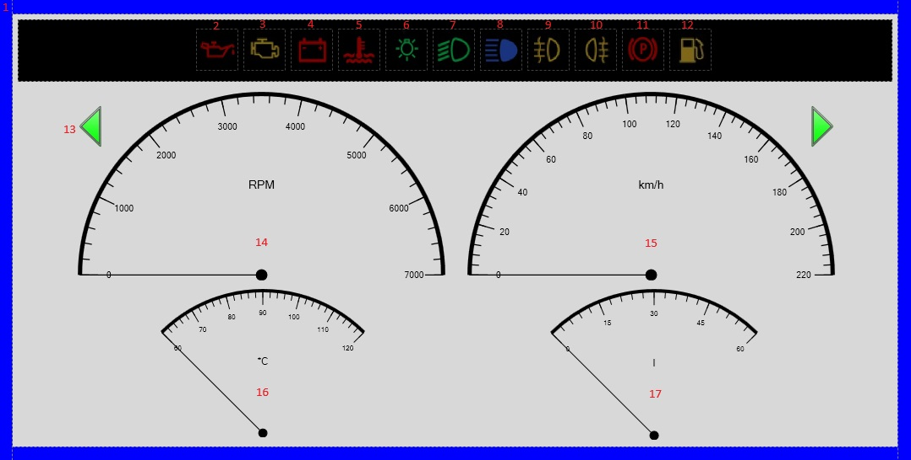
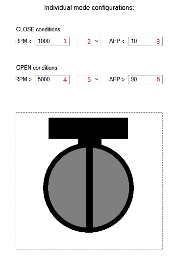
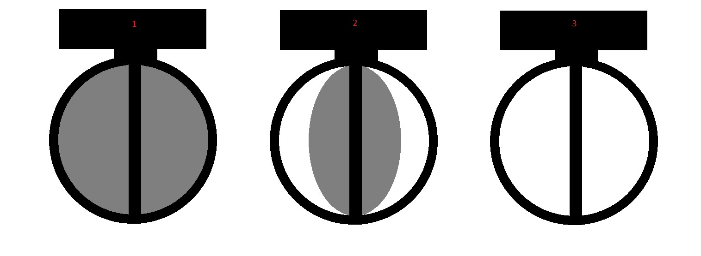

# CANoe Test Network
## A simulation of a CAN network connecting four nodes performed in CANoe:
1) **Engine controller** (Engine)
2) **Body controller** (Body)
3) **Instrument cluster** (Dashboard)
4) **Additional exhaust system throttle controller** (AEC)

## 1) Engine
### Control panel:
 
1) Engine state label - "RUNNING/STOPPED
2) Input Accelerator Pedal Position to define set engine RPM
3) Switch to simulate engine fault
4) Switch to simulate low oil pressure

### Calculations:
- The engine state is determined based on the ignition position sent from the Body module. Frame transmission and some calculations are performed when the ignition is on, but all simulations are only executed in the running mode (after the engine starts).
- The input signal from the accelerator pedal sensor is used to determine the target engine RPM. Based on this RPM and the selected gear (signal from the Body module), the actual RPM is simulated using a simple proportional controller (P-type).
- The vehicle speed is determined based on the actual RPM and the selected gear.
- The coolant temperature is determined based on the actual RPM and engine load. There are four types of calculations: standard heating (up to 90°C), overheating (reduced heating coefficient simulating thermostat opening), standard cooling (after the engine is turned off), and cooling during overheating (cooling down to 90°C if the engine RPM does not exceed 5000 RPM).
- Fuel consumption (and the simulated decrease in fuel level in the Body module) is calculated based on the accelerator pedal position and the current gear.
Additionally, it is possible to simulate engine failure or low oil pressure using corresponding switches.

### Messages:

#### - Eng_States (0x100)

Signals:
- Eng_APP (8bit)
- Eng_CLT (8bit)
- Eng_RPM (8bit)
- Eng_VehicleSpeed (8bit)
- Eng_Running (1bit)
- Eng_Check_Engine (1bit)
- Eng_Oil_Press_Warn (1bit)

## 2) Body
### Control panel:
 
1) Parking lights
2) Low beam lights
3) High beam lights
4) Front fog lights
5) Rear fog light
6) Blinkers
7) Main lights switch
8) Rear fog light switch
9) Front fog light switch
10) High beam switch (constant)
11) High beam switch (blink)
12) Ignition/Start switch
13) Blinkers switch
14) Hazard warning lights switch
15) Driving mode selector
16) Handbrake switch
17) Gear selector

### Calculations:
- All calculations are performed when the ignition is on or after the engine start (with the exception of the ability to turn on the hazard lights).
- The module simulates the change in battery voltage (12V with the ignition on or 14.3V after the engine start).
- The operation of the turn signals and hazard lights is controlled by a separate Timer.
- The headlights can be set to either stay on continuously or flash (activating the flashing mode disables the continuous mode).
- The fog lights can be activated with specific buttons and work when the ignition and headlights are on.
- The parking brake is a simple switch.
- The drive mode selector allows you to choose between Comfort, Auto, Dynamic, and Individual modes.
- The gear selector can be set to N, 1, 2, 3, 4, 5, 6, R.

### Messages:

#### - BodyStates (0x200)

Signals:
- Body_Baterry_Voltage (8bit)
- Body_Fuel_Level (8bit)
- Body_Drive_selet (8bit)
- Body_Position_Lights (2bit)
- Body_Gear (3bit)
- Body_Ign_Status (2bit)
- Body_Handbrake (1bit)
- Body_Low_Beam (1bit)
- Body_High_Beam (1bit)
- Body_Front_Fog (1bit)
- Body_Rear_Fog (1bit)

#### - BodyBlink (0x201)

Signals:
- Body_Blinker (2bit)

## 3) Dashboard 
### Control panel:
 
1) Driving mode color backlight
2) Low oil pressure indicator
3) Check engine indicator
4) Low baterry voltage indicator
5) High coolant temperature indicator
6) Parking lights indicator
7) Low beam lights indicator
8) High beam lights indicator
9) Front fog lights indicator
10) Rear fog light indicator
11) Handbrake indicator
12) Low fuel level indicator
13) Blinkers indicator
14) Tachometer
15) Speedometer
16) Coolant temperature gauge
17) Fuel level gauge

### Calculations:
- The color of the instrument cluster backlight is determined based on the driving mode (from the Body module).
- The low battery voltage indicator lights up when the voltage drops below 13V.
- The low fuel level indicator lights up when the fuel level is below 20 liters.
- The high engine temperature indicator lights up when the temperature exceeds 110°C.
- The remaining icons are controlled directly by receiving an on/off signal from the CAN bus.
- Signals for engine RPM, vehicle speed, and engine temperature are sent from the Engine module.
- The fuel level signal is sent from the Body module.

### Messages

The Dashboard module does not send any signals, it only receives them from Body and Engine modules.

## 4) AEC 
### Control panel:

1) Threshold RPM for closing
2) Logical condition for closing (and/or)
3) Threshold value of accelerator pedal depression for closing
4) Threshold RPM for opening
5) Logical condition for opening (and/or)
6) Threshold value of accelerator pedal depression for opening

### Calculations:
Based on signals from the Body and Engine modules, three throttle opening levels are set:

1) Closed
2) Slightly open
3) Open
   
- When the engine is off, the exhaust valve is closed.
- In Comfort mode, the exhaust valve is closed regardless of other parameters.
- In Dynamic mode, the exhaust valve is open regardless of other parameters.
- In Auto mode, the exhaust valve is:
  - Closed if RPM < 2000 and APP < 40%
  - Open if RPM > 5000 and APP > 60%
  - Slightly open in all other cases
- In Individual mode, the exhaust valve is set in the same way as in Auto, but the RPM and APP values (and the logical condition connecting them (and/or)) can be adjusted by the user.
Additionally, the entered values are protected against the input of incorrect values.
